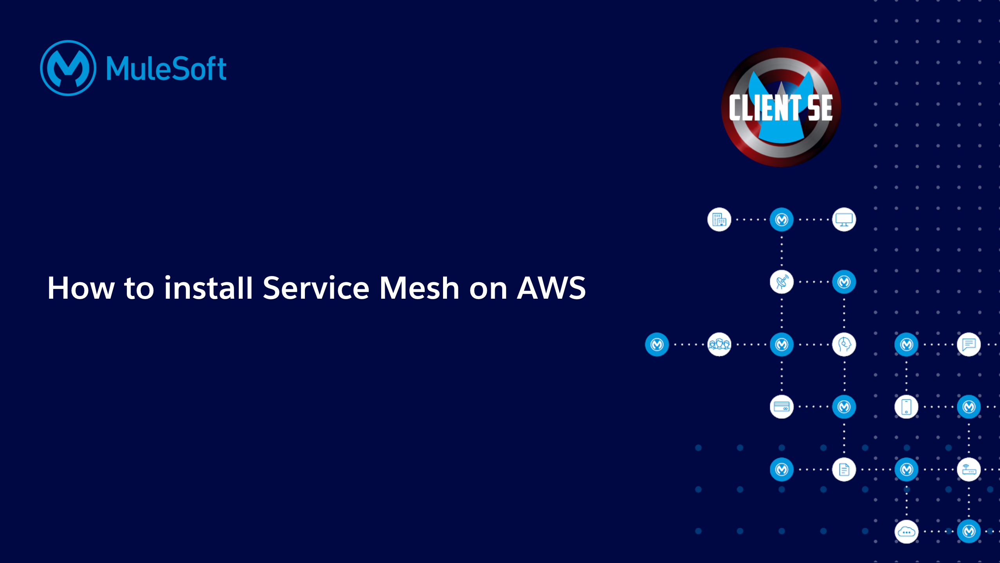  
Update: August 1, 2020

## Introduction

This cookbook will walk you through the process of installing **Anypoint Service Mesh** on **AWS**. You will deploy a demo application and secure using Anypoint Service Mesh.

***To log issues***, click here to go to the [github](https://github.com/mulesoft-consulting/ASMonGCP/issues) repository issue submission form.

## Objectives

- **[Create an Amazon EKS Cluster](#installaks)**
    - [**STEP 1**: Create an AWS EKS Cluster](#step1)
    - [**STEP 2**: Create a Node Group](#step2)
    - [**STEP 3**: Verify Cluster and Connect](#step3)

- **[Install Istio](#installistio)**
    - [**STEP 4**: Download and Install Istio CLI](#step4)
    - [**STEP 5**: Install Istio using CLI](#step5)

- **[Deploy Demo Application](#deploydemo)**
    - [**STEP 6**: Clone Demo Application](#step6)
    - [**STEP 7**: Deploy Demo Application](#step7)

- **[Install Anypoint Service Mesh](#installasm)**
    - [**STEP 8**: Install Anypoint Service Mesh](#step8)
    - [**STEP 9**: Install Anypoint Service Mesh Adapter](#step9)
    - [**STEP 10**: Create API's](#step10)
    - [**STEP 11**: Binding API's with Services](#step11)

- **[Apply API Management Policies](#applypolicy)**
    - [**STEP 12**: Apply Rate Limiting Policy to Customer API](#step12)
    - [**STEP 13**: Apply Client ID enforcement Policy to Payment API](#step13)

- **[Report & Monitor API Analytics](#reportmonitoranalytics)**
	- [**STEP 14:** View Analytics of Customer API & Payment API](#step14)
	- [**STEP 15:** View Dashboards of Customer API & Payment API](#step15)


## Required Artifacts

- The following lab requires an AWS Cloud Platform account.
- Access to [Anypoint Platform](https://anypoint.mulesoft.com/)

For complete instructions please visit [MuleSoft Documentation](https://docs.mulesoft.com/service-mesh/1.0/)

<a id="installaws"></a>
## Create AWS EKS cluster

<a id="step1"></a>
### **STEP 1**: Create AWS EKS Cluster

- From any browser, go to the URL to access AWS Cloud Console:

   <https://aws.amazon.com/console/>

- Select **Elastic Kubernetes Service**

    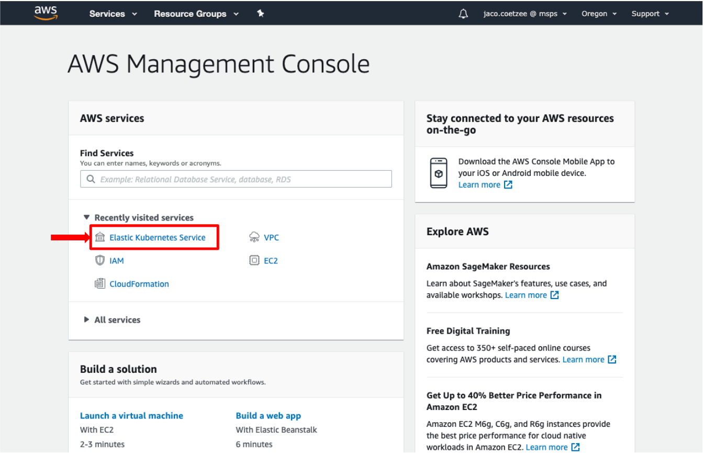

- Click **Create cluster**

	 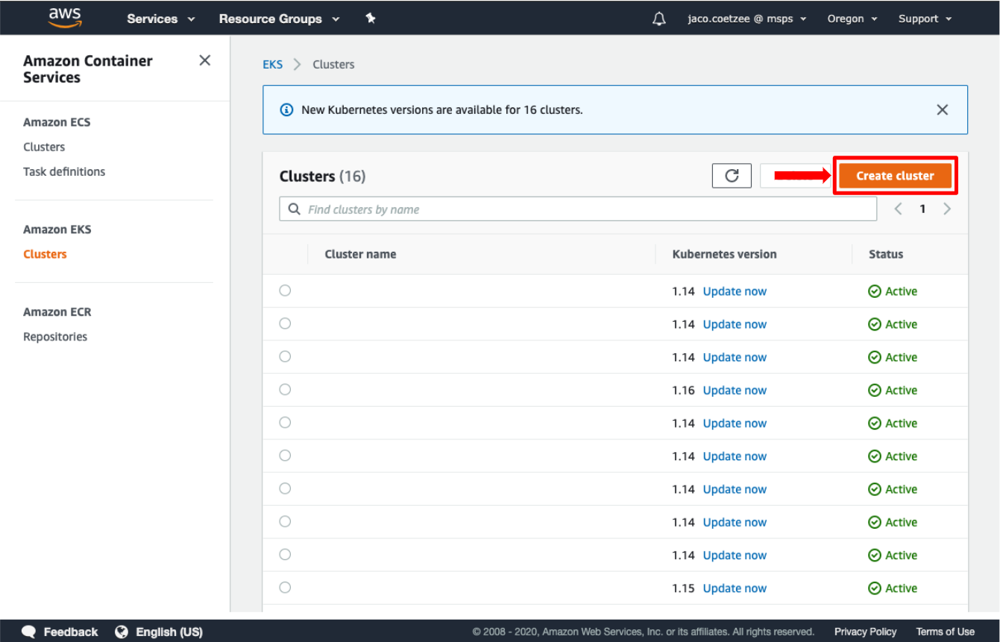

- Enter **name** for the cluster and select an appropriate **Cluster Service Role**

    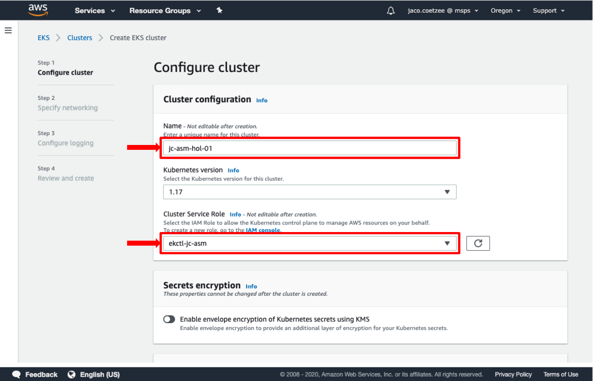

- Click **Create**. Wait for the cluster to be created.

    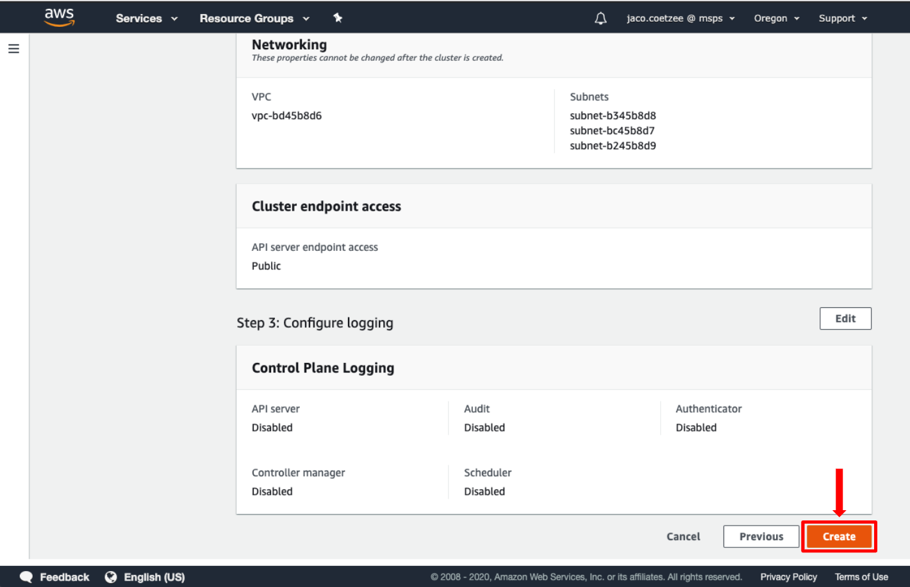

<a id="step2"></a>
### **STEP 2**: Create a Node Group

- Click on the compute tab in your newly created EKS Cluster. Select **Add Node Group**

    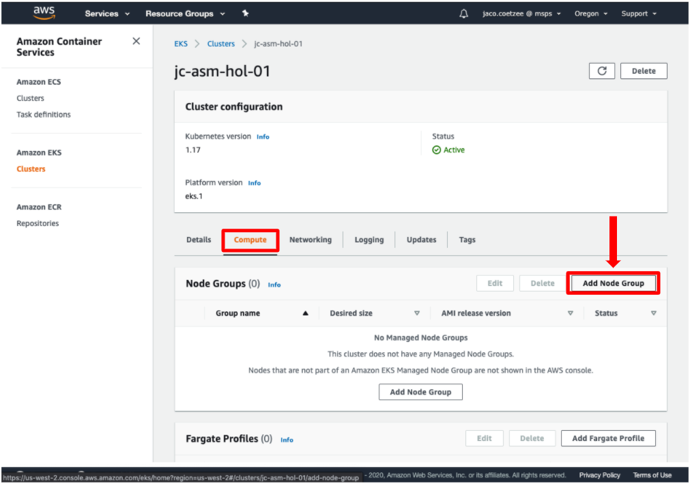

- Complete the **Name** field

- Select the appropriate **Node IAM Role** for your node group.

    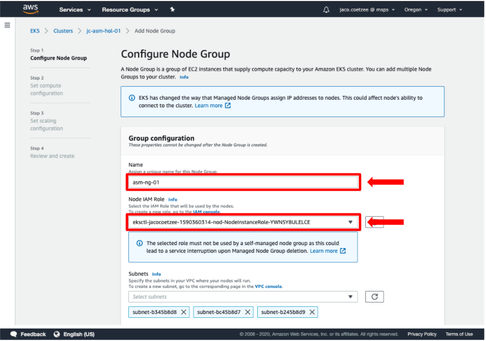
    
- Select **SSH key pair** and click **Next**.

    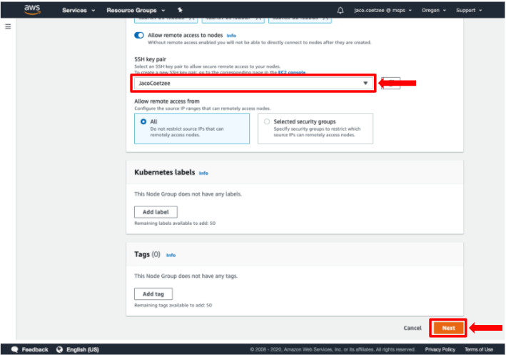

- Expand the **Instance type** and select **m5.xlarge**. Per [documentation](https://docs.mulesoft.com/service-mesh/1.0/prepare-to-install-service-mesh#hardware-requirements) and click **Next**

    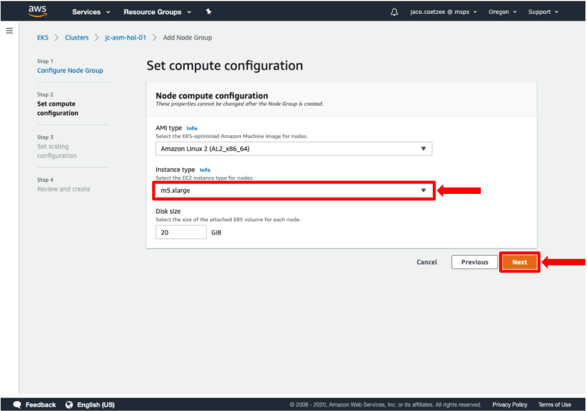

- Scroll to the bottom and click **Create** and wait for the Node Group to be created.

    

<a id="step3"></a>
### **STEP 3**: Verify Cluster and Connect

- Open up a terminal and type **aws configure**. Complete the **AWS Access Key ID** and the **AWS Secret Access Key**. Make sure you specify the correct **default region name** and leave the **Default output format** to **None**.

    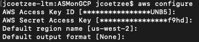

- Make sure you are setting the correct context and update your AWS kube config.

```bash
aws eks --region us-west-2 update-kubeconfig --name <yournamespace>
```

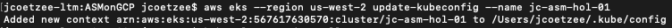


- Next running the following command to verify that you cluster is running.

```bash
kubectl get pods --all-namespaces
```

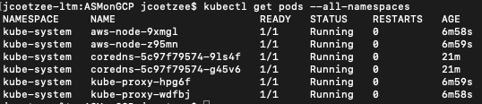

<a id="installistio"></a>
## Install Istio

<a id="step4"></a>
### **STEP 4**: Download and Install Istio CLI

- To install **Istio** we will be using the **Istio CLI**. For completed instructions [Istio Docs](https://istio.io/docs/setup/install/istioctl/)

- Use the following command to download **Istio CLI** into your directory of choice. In this example I am using directory **/Users/dennis.foley/ASM**

```bash
curl -L https://istio.io/downloadIstio | ISTIO_VERSION=1.7.2 sh -
```


- Change into newly downloaded directory

```bash
cd istio-1.7.2/
```

- Add current directly to path

```bash
export PATH=$PWD/bin:$PATH
```


<a id="step5"></a>
### **STEP 5**: Install Istio using CLI
- To install **Istio** we will be using the **Istio CLI**. From the **istio** directory run the following command. At the prompt **Proceed? (y/N)** enter **y**

```bash
istioctl install
```

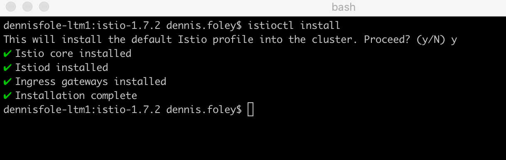

- Verify that **Istio** has been installed. You should now see the **istio-system** namespace

```bash
kubectl get namespaces
```

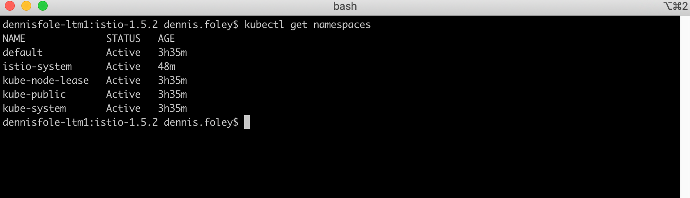

<a id="deploydemo"></a>
## Deploy Demo Application

<a id="step6"></a>
### **STEP 6**: Clone Demo Application

- For our demo application will will be using **Mythical Retail** shopping cart application. This web based UI will call several services to complete the order.

- Clone the demo application git repository onto your local machine.

```bash
git clone https://github.com/mulesoft-consulting/ServiceMeshDemo
```

- Change to the **ServiceMeshDemo** directory and list out the contents to verify that the repository has been created correctly

```bash
cd ServiceMeshDemo/
ls
```

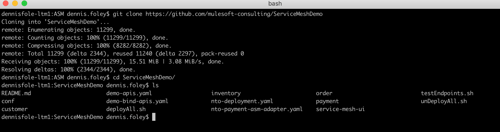

<a id="step7"></a>
### **STEP 7**: Deploy Demo Application

- We will now deploy the demo application to your kubernetes cluster. The deployment script takes the namespace as a parameter. We will be using **mythical-payment** for namespace

```bash
./deployAll.sh mythical-payment
```

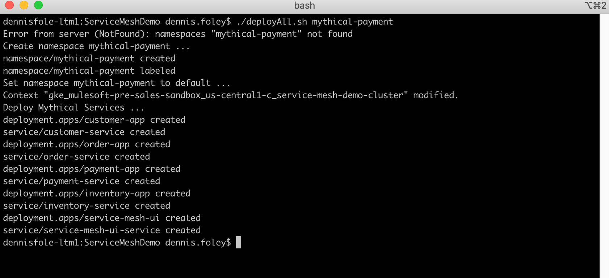

- You can monitory the deployment with the following commands

```bash
kubectl get pods -n mythical-payment
kubectl get services -n mythical-payment
```

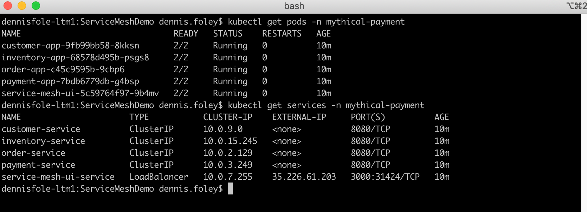

- Once all services are running you can test out the application. To access the application open you browser and go to the following URL

```bash
http://<EXTERNAL-IP>:3000
```

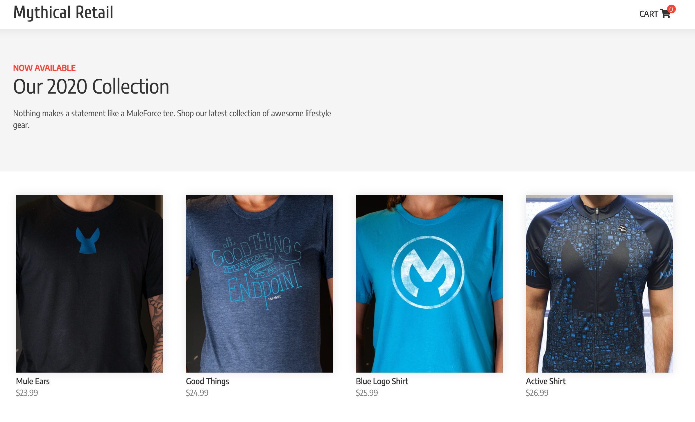

- To test out the application follow these steps:

    - Select Item to purchase
    - Click **Add to Cart**
    - Click **Checkout**
    - Leave default email and click **CONTINUE**
    - Click **AUTHORIZE PAYMENT**
    - Last click **PLACE ORDER**

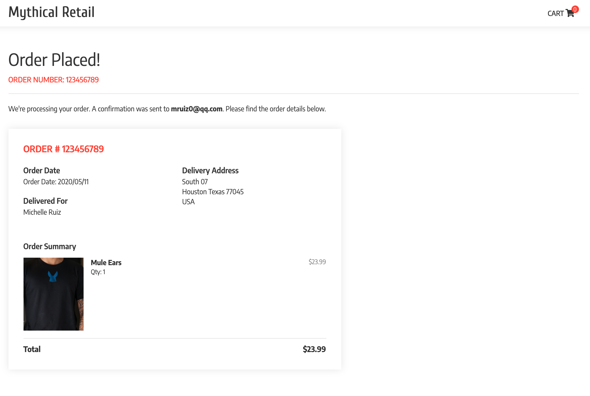

<a id="installasm"></a>
## Install Anypoint Service Mesh

<a id="step8"></a>
### **STEP 8**: Install Anypoint Service Mesh

For complete instructions and documentation please visit [MuleSoft Docs](https://docs.mulesoft.com/service-mesh/1.1/)

- Download the latest Anypoint Service Mesh CLI and make it executable

```bash
curl -Ls http://anypoint.mulesoft.com/servicemesh/xapi/v1/install > asmctl && chmod +x asmctl
```

- Now we are ready to install Anypoint Service Mesh. To do this we will call **asmctl install**. This command requires 3 parameters
    - Client Id
    - Client Secret
    - Service Mesh license

- If you are not familiar with how to get environment Client Id and Secret, navigate to **API Manager** and click on the **Environment Information** button.

- If you are not familiar with how to get environment Client Id and Secret, navigate to **API Manager** and click on the **Environment Information** button.

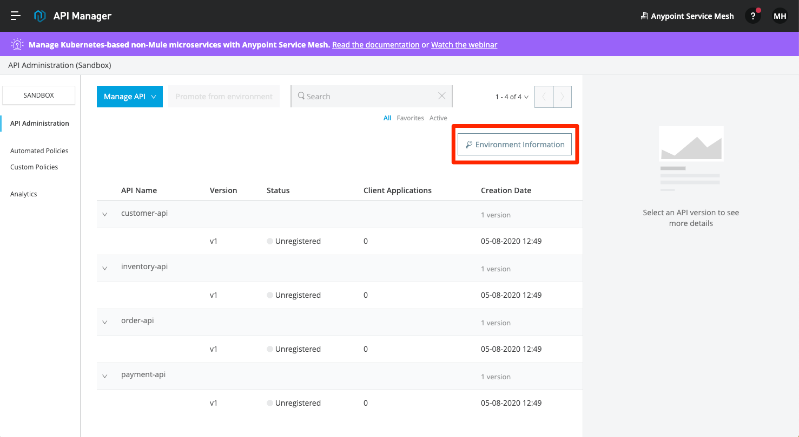

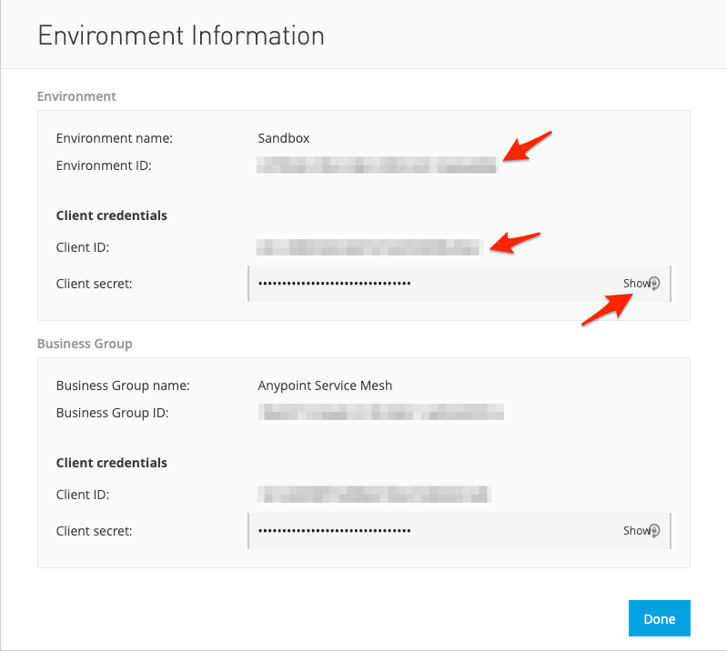

```bash
./asmctl install
```


- Verify that Anypoint Service Mesh has been installed correctly with the following command

```bash
kubectl get pods -n service-mesh
```


<a id="step9"></a>
### **STEP 9**: Install Anypoint Service Mesh Adapter

- Next we want to deploy the Anypoint Service Mesh adapter in each namespace that we want to monitor API's. For this example we will just be doing the **nto-payment** namespace that contains the demo application.

- To deploy the ASM Adapter we will be using a Kubernetes custom resource definition (CRD). In the **ServiceMeshDemo** repository we have create the file **nto-payment-asm-adapter.yaml** that can modified.

    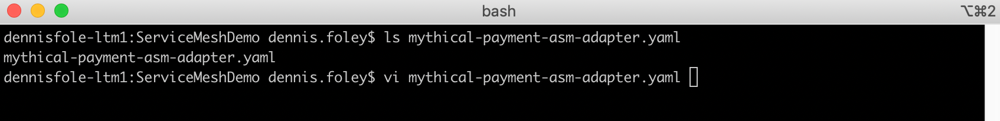

- Replace **```<CLIENT ID>```** and **```<CLIENT SECRET>```** with values for your environment. Save file and run the following command

```bash
kubectl apply -f mythical-payment-asm-adapter.yaml
```

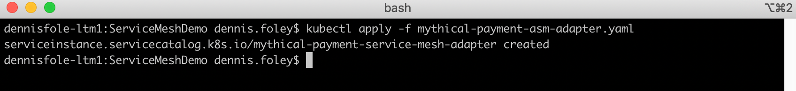

- Use the following command to monitor the progress. Wait for status to change to **Ready**

```bash
asmctl adapter list
```

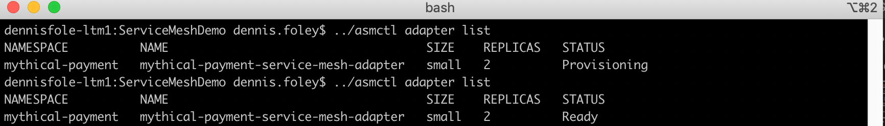

<a id="step10"></a>
### **STEP 10**: Create API's

- We will now use now use Anypoint Service Mesh auto discovery to create API's in Anypoint Platform. We will create API's for Customer, Inventory, Order and Payments services that are used by the demo application.

- Before creating the APIs, ensure the Anypoint Platform user has **API Manager Environment Administrator** permission, in addition to **Manage APIs Configuration**. This can be done by your organization admin in **Access Management*.

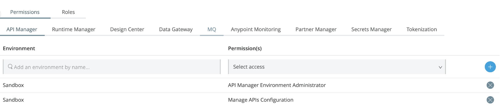
 

- Modify the Kubernetes custom resource definition (CRD) file **demo-apis.yaml**. 

- For each API, replace **```<ENV ID>```**, **```<USER>```** and **```<PASSWORD>```** with the values for your environment. If you are unsure how to get the environment Id check out this [article](https://help.mulesoft.com/s/question/0D52T00004mXPvSSAW/how-to-find-cloud-hub-environment-id). Save the file and run the following command

***NOTE: *** If you run this multiple times you might need to change the version number since Anypoint Platform will keep it around for 7 days.

```bash
kubectl apply -f demo-apis.yaml
```

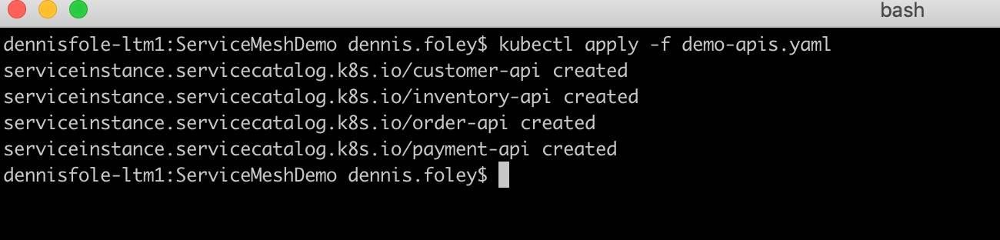

- Use the following command to monitor the progress. Wait for status to change to **Ready**

```bash
asmctl api list
```

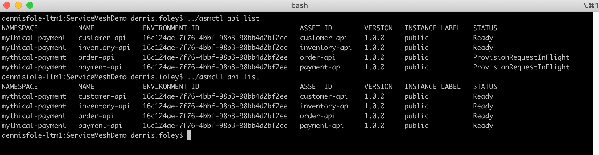

- You can also verify that the API's have been created in Anypoint Platform. Go to Anypoint Platform and navigate to **API Manager**

    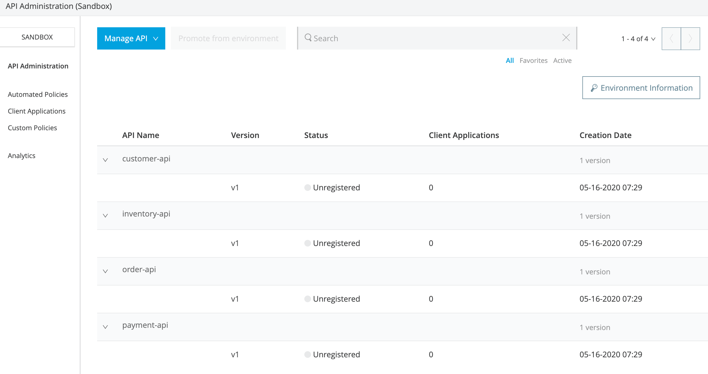

<a id="step11"></a>
### **STEP 11**: Binding API's with Services

- The last step is to bind the Kubernetes Services with the Anypoint Platform API's. To do this you will use the binding definition file **demo-bind-apis.yaml**. Execute the following command

```bash
kubectl apply -f demo-bind-apis.yaml
```

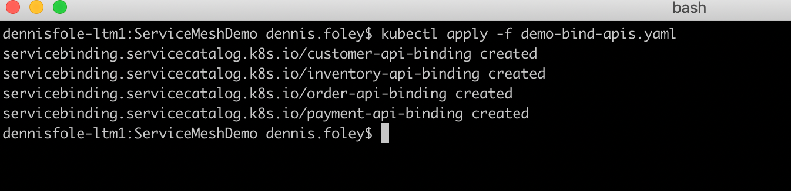


- Use the following command to monitor the progress. Wait for status to change to **Ready**

```bash
asmctl api binding list
```

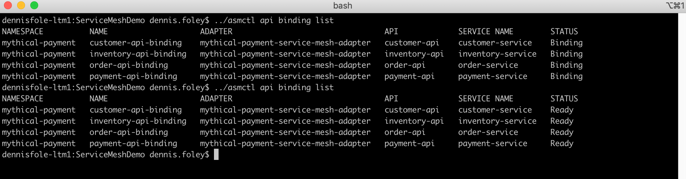

- If you go may to **API Management** in Anypoint Platform and refresh the page you will see that the API's are now **Active**. 

- You have completed the installation of Anypoint Service Mesh. In the next section we will walk through applying some policies against the kubernetes services.

<a id="applypolicy"></a>
## Apply API Management Policies

<a id="step12"></a>
### **STEP 12**: Apply Rate Limiting Policy to Customer API

- From the **API Management** Screen in Anypoint Platform click on the version number for **customer-api**

    

- Click **Policies** and then click **Apply New Policy**. Expand **Rate Limiting** select newest version and click **Configure Policy**. 

    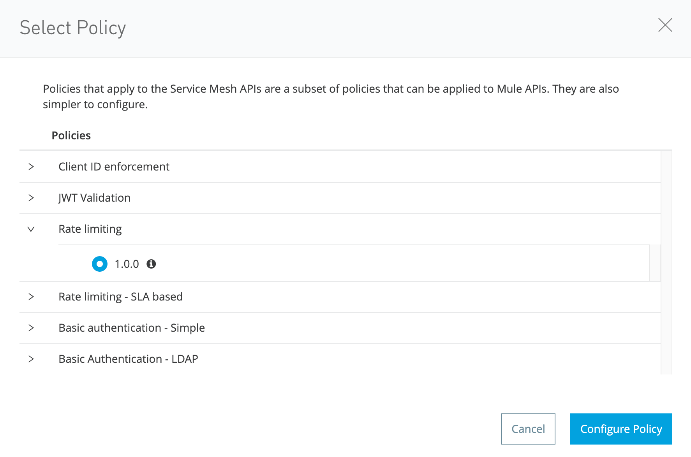

- We will configure the rate limit to be 1 call per minute. Click **Apply**

    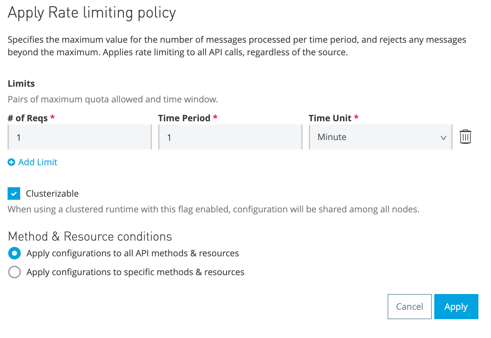

- You should now see your new **Rate limiting** policy. To test this out run through the order process in the demo application. Try to run through it 2 times within a minute. The second time through you will get **Account Retrieval Failed** error.

    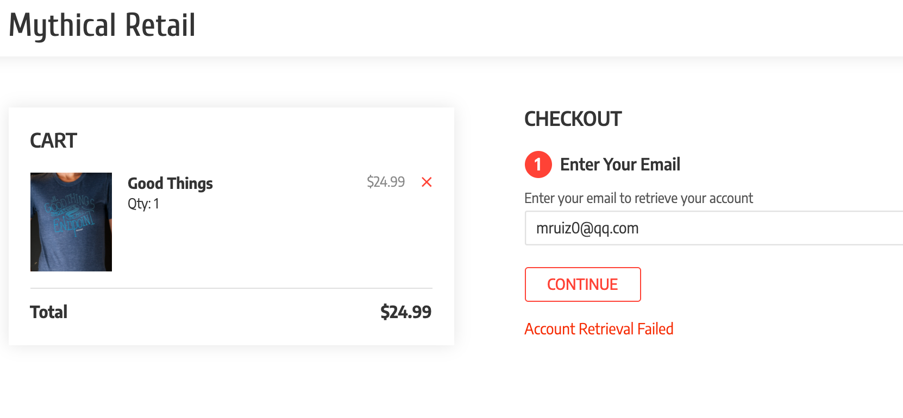

- Before moving onto the next step remove the **Rate Limiting** policy.

<a id="step13"></a>
### **STEP 13** Apply Client ID enforcement Policy to Payment API


- Click **Policies** and then click **Apply New Policy**. Expand **Client ID enforcement** select newest version and click **Configure Policy**. 

    

- Leave all defaults and click **APPLY**

- You should now see your new **Client ID enforcement** policy. Once again run through the demo application but this time you should see **Payment Authorization Failed** when you click **AUTHORIZE PAYMENT**

    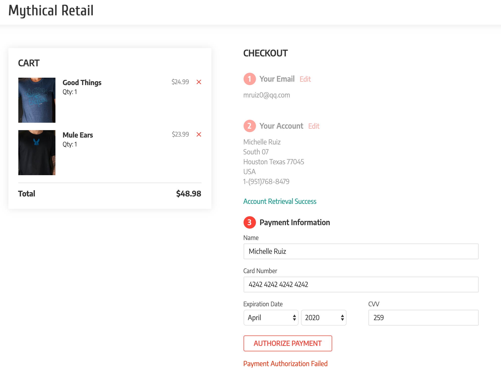


<a id="reportmonitoranalytics"></a>
## Report & Monitor API Analytics

<a id="step14"></a>
### **STEP 14**: View Analytics Reports Dashboards of Customer API & Payment API

- From **API Manager**, click on **Analytics** on the left.

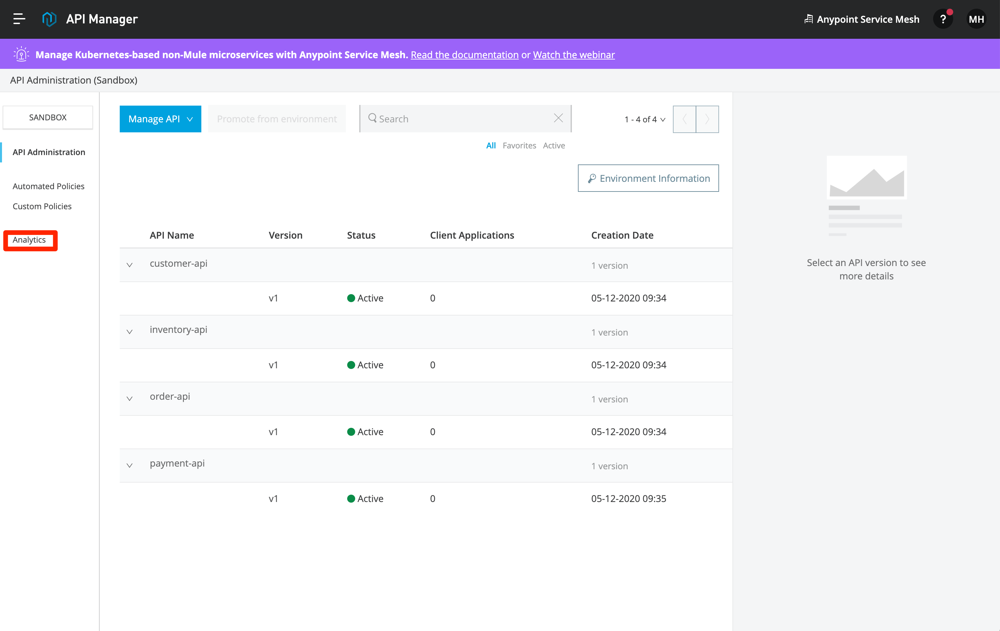

- At the top, select the desired date range, filter by the APIs, and check **Include Policy Violations**

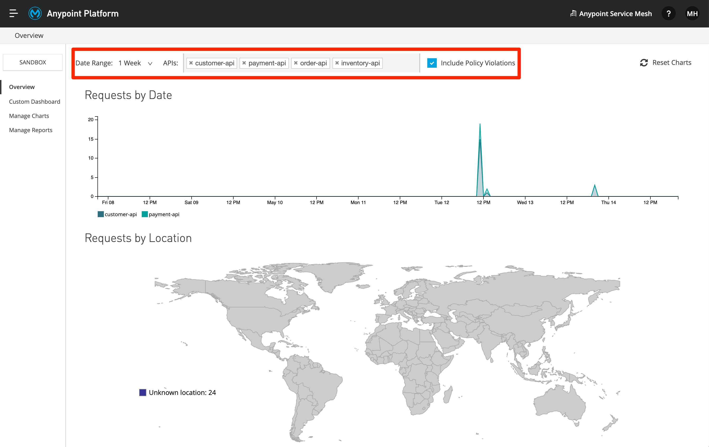

- You can also build a report for API Analytics collected from service-service communication. The API Analytics provides insights into health of managed APIs - status code, policy violations, response time and such.  
Follow [MuleSoft API Analytics Documentation](https://docs.mulesoft.com/api-manager/2.x/analytics-event-api#creating-a-report) to create an API Analytics report for all APIs and review if APIs are working as expected.

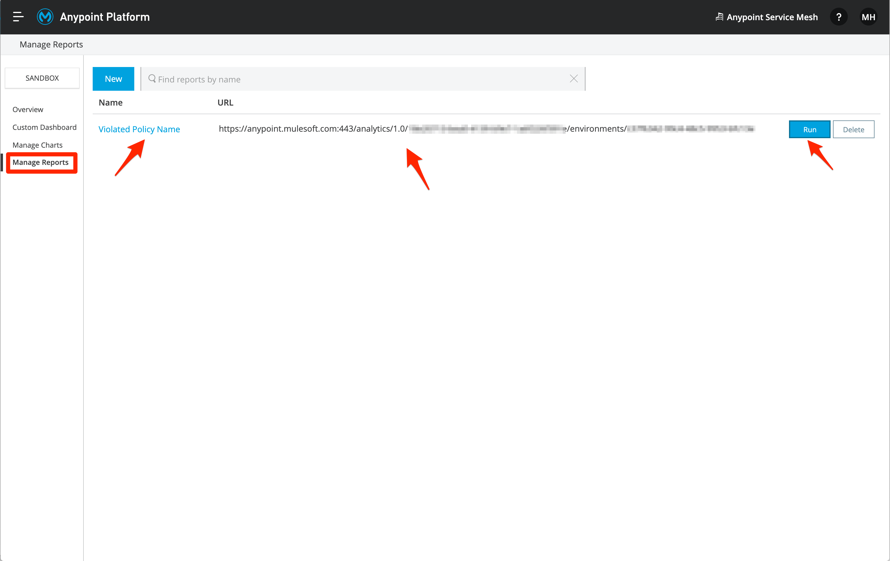

- Click on *Run* of the report, you could download the report in the browser or view the report usring curl with the report URL to look at more details.

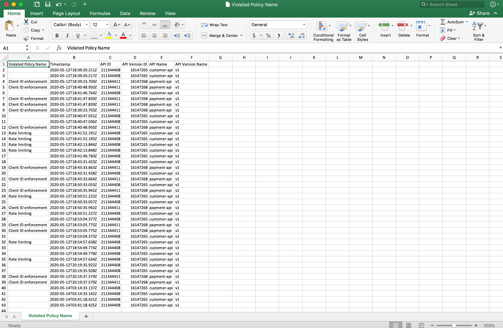
[Violated Policy Name.csv](Violated%20Policy%20Name.csv)

<a id="step15"></a>
### **STEP 15**: View Dashboards of Customer API & Payment API
- Navigate to the **Anypoint Monitoring** from either Anypoint Platform home page, or the hamburger menu at the top left corner.

- You can click on **Built-in dashboards** on the left to check out what's populated for the Customer & Payment APIs. In the drop-down, choose the **environment**, **resource name**, and the **API version / Instance**, and click on **View**. 

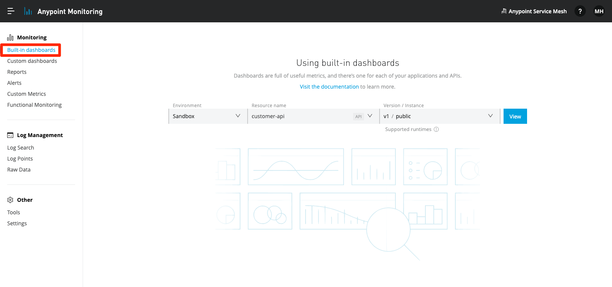

- At the top right corner of the dashboard, adjust the time period and turn on Auto-Refresh for **Customer API**. 

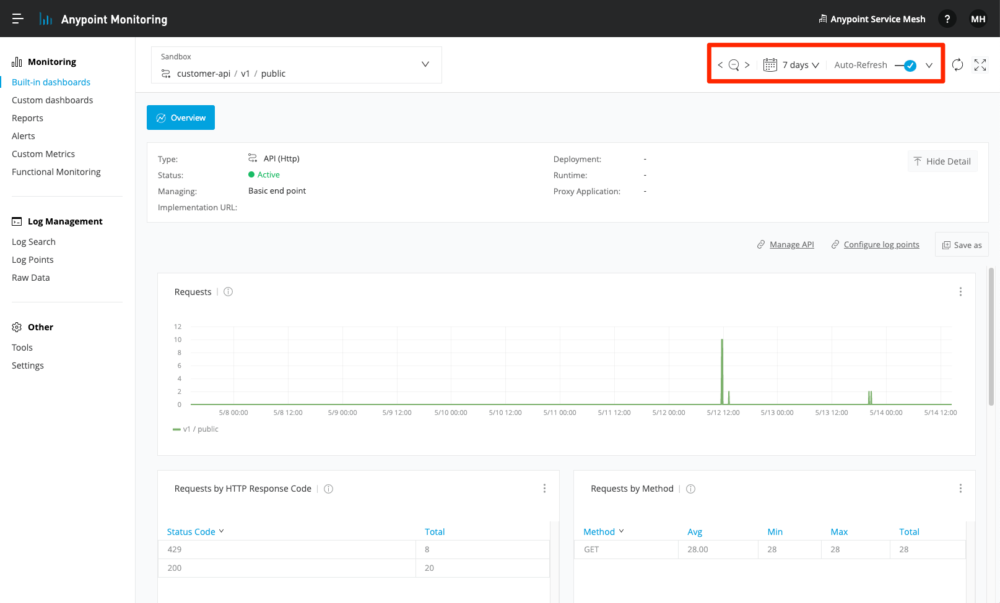

- Repeat the above and choose **Payment API** this time and check out its Analytics as well. 

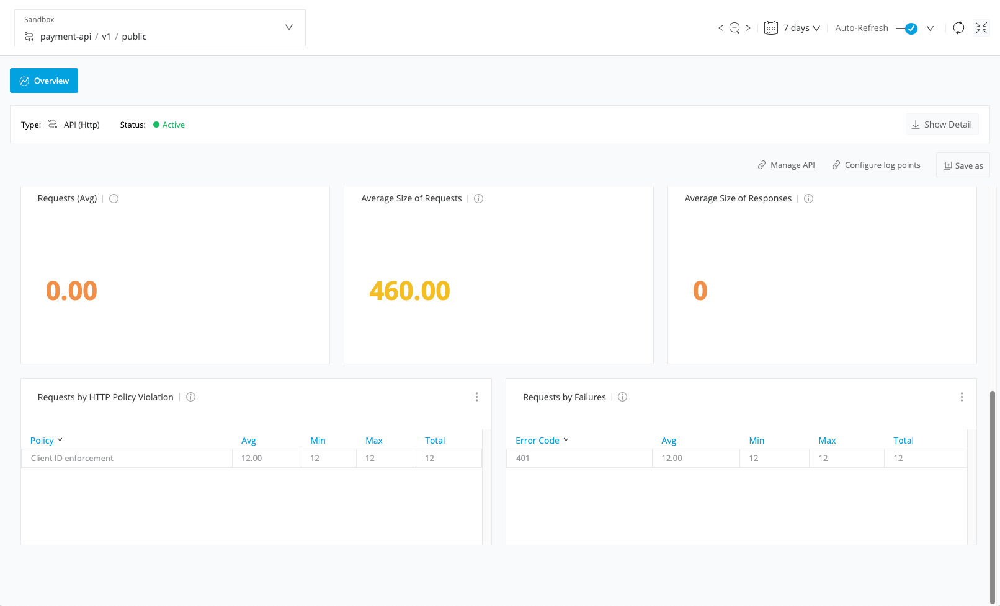


**CONGRATULATIONS!!!** You have completed installing Anypoint Service Mesh, applying policies to kubernetes services, reporting and monitoring the analytics of these non-Mule services via Anypoint Platform.
